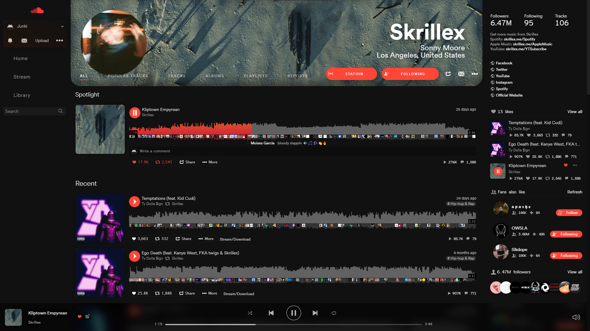

<h1>Soundcloud Hyper Dark</h1>
<h3>A full modern redesign of the outdated Soundcloud UI.</h3>

  ) 

<h2>Installation:</h2>
<ol>
  <li><b>Install the Stylus extension: <a href="https://chrome.google.com/webstore/detail/stylus/clngdbkpkpeebahjckkjfobafhncgmne">Chrome Web Store</a></b> <i>|</i> <b><a href="https://addons.mozilla.org/en-US/firefox/addon/styl-us/">Firefox</a></b></li>
  <li>
<b>Install UserCSS style from: <a href="https://cdn.jsdelivr.net/gh/junkiedm/scultradark/SC-HyperDark.user.css">📦 GitHub</a></b> <i>|</i> <b><a href="https://userstyles.world/style/70">🔗 UserStyles.world</a></b> <i>|</i> <b><a href="https://greasyfork.org/en/scripts/466541-soundcloud-hyper-dark">🔗 Greasy Fork</a></b>

</li>
</ol>
 

### Preview:  
 

**Note**: Soundcloud is currently testing a UI redesign, starting with the [user tracks page](https://soundcloud.com/n/you/tracks). Some things are styled with this theme but most aren't, and many things are likely to be broken as SC rolls this update out for other pages. When more pages are updated to the new UI I'll try to start trying to rewrite this style for it since this one is over 5k lines of inconsistent conventions, overriding properties and overall messiness. I'll be using the less preprocessor that's built-in to Stylus for the rewrite to make organizing things a bit easier.

 
***

  
<s>Install userscript to get rid of "Tracks by..." etc on profile pages.</s> (no longer necessary)

  <ol>
    <li><b>Install a userscript manager:</b>
      <ul>
        <li>Chrome: <a href="https://chrome.google.com/webstore/detail/tampermonkey/dhdgffkkebhmkfjojejmpbldmpobfkfo">Tampermonkey</a> or <a href="https://chrome.google.com/webstore/detail/violent-monkey/jinjaccalgkegednnccohejagnlnfdag">Violentmonkey</a></li>
        <li>Firefox: <a href="https://addons.mozilla.org/firefox/addon/greasemonkey/">Greasemonkey</a>, <a href="https://addons.mozilla.org/firefox/addon/tampermonkey/">Tampermonkey</a>, or <a href="https://addons.mozilla.org/firefox/addon/violentmonkey/">Violentmonkey</a></li>
        <li>Safari: <a href="http://tampermonkey.net/?browser=safari">Tampermonkey</a> or <a href="https://apps.apple.com/app/userscripts/id1463298887">Userscripts</a></li>
      </ul>
    </li>
    <li>
<b><a href="https://greasyfork.org/en/scripts/429743-revert-user-headers">Install "Revert user headers" script from greasyfork</a></b>
</li>
  </ol>

### *Find more styles at [UserStyles.world](https://userstyles.world/explore) and [UserStyles.org (Archive)](https://33kk.github.io/uso-archive/)!*    
### Credits:  
[Primarily based on 'SoundCloud Ultra Dark' by IgChi](https://33kk.github.io/uso-archive/?style=176264)  
['SoundCloud - Quite Dark' by pawelos076232](https://33kk.github.io/uso-archive/?style=143738)  
*~~['Custom Waveform Hue' by CriAsuDre](https://33kk.github.io/uso-archive/?style=123974)~~ (No longer included as of v0.9.120)*   
[Font used: 'Inter'](https://rsms.me/inter/) [by @rsms](https://twitter.com/rsms)    
***NO LONGER MAINTAINED:** [📦 Ultra Dark "Cover-style" Profile Headers](https://github.com/JunkiEDM/scultradark/raw/master/SC-UltraDark-MOD-oldheader.user.css)*  
