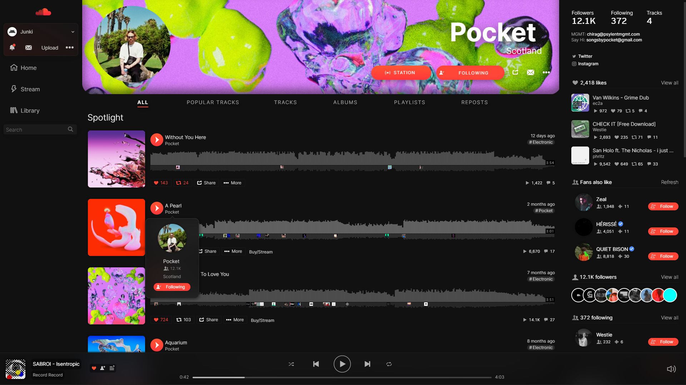

# SoundCloud Ultra Dark (Modified)
*[Install the Stylus browser extension to install this UserCSS theme!](https://chrome.google.com/webstore/detail/stylus/clngdbkpkpeebahjckkjfobafhncgmne)*    
UserStyle Modification of SoundCloud Ultra Dark by IgChi: userstyles.org/styles/176264  
[📦 Install UserCSS Style (Supports automatic updates)](https://github.com/JunkiEDM/scultradark/raw/master/SC-UltraDark-MOD.user.css)  
Preview:  
    
**NO LONGER MAINTAINED:** [📦 Install UserCSS Style (With old 'cover-style' profile headers)](https://github.com/JunkiEDM/scultradark/raw/master/SC-UltraDark-MOD-oldheader.user.css)  
